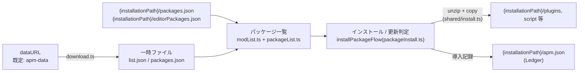

# ARCHITECTURE

apm の構造の現在地。作業ルール・確定方針は [AGENTS.md](AGENTS.md) を参照。

## プロセス構成

Electron の 3 窓 + main プロセス。窓はすべて `sandbox: true`。

| 窓     | renderer                                                                                                               | preload                         |
| ------ | ---------------------------------------------------------------------------------------------------------------------- | ------------------------------- |
| main   | `src/renderer/main/`(単一 React ルートの `App` + tRPC。タブ単位のディレクトリ。起動フローは `startup.ts` — 順序が仕様) | ログ捕捉 + tRPC bridge 公開のみ |
| about  | `src/renderer/about/`(React + tRPC)                                                                                    | ログ捕捉 + tRPC bridge 公開のみ |
| splash | `src/renderer/splash/`                                                                                                 | なし                            |

- ビジネスロジックは main プロセス(`src/main/services/`)。renderer からは tRPC(trpc-electron)で呼ぶ
- このほか `services/browser.ts` がダウンロード用のモーダルブラウザ窓を動的に生成する(forge の renderer エントリではない)
- IPC は tRPC に集約済み。例外は preload のエラーハンドラ用ダイアログの 1 チャンネルのみ(`src/common/ipc.ts` + `src/lib/ipcWrapper.ts`。preload に tRPC クライアントを置けない理由は `src/common/ipc.ts` のコメントを参照)

## ディレクトリと責務

```
src/
  shared/     electron 完全非依存の純粋モジュール(main / renderer 両方から import 可)。
              ユニットテストの主対象。fs 依存の可否は AGENTS.md 落とし穴を参照
  lib/        renderer から使う electron 依存モジュール(ipcWrapper = preload 専用)
  common/     preload 専用 IPC のチャンネル名定義(ipc.ts)
  main/       main プロセス(下記)
  renderer/   窓ごとの UI(上の表を参照)。main/ 配下はタブ単位
              (aviutl / packages / nicommons / settings / others)
  types/      型定義
```

main プロセスの内訳:

```
src/main/
  index.ts        エントリ(ログ・config 初期化、app イベント、ハンドラ登録)
  windows.ts      窓生成(splash / main / about)+ tRPC ハンドラの張り付け
  ipcHandlers.ts  preload 専用 IPC ハンドラの登録(エラーダイアログのみ)
  api/            tRPC ルーター(index = 集約、trpc = middleware、
                  ドメイン別ルーターの procedure から services/ を呼ぶ。
                  installationPath 入力は middleware が Installation に解決して渡す)
  services/       ビジネスロジック(packageList / packageInstall /
                  packageUninstall / scriptInstall / packageShare / core /
                  download / modList / migration / appUpdate / settings /
                  nicommons / browser)
  Config.ts       electron-store による設定
  installation.ts インストール先の集約 Installation(path / ledger() /
                  localRepoPath)。ユースケース系 services が受け取る
  Ledger.ts       導入記録 Ledger = {installationPath}/apm.json の読み書き
```

## データフロー(パッケージ管理の中核)



- dataURL は自由入力(allowlist しない)。防御は `src/shared/resolvePath.ts` の同一オリジン + 親ディレクトリ脱出禁止(確定方針)
- `{installationPath}` = ユーザーが選ぶ AviUtl インストールフォルダ。apm の状態はすべてここと electron-store(`Config.ts`)にある
- ファイルの整合性は apm-data 側の ssri ハッシュを `src/shared/integrity.ts` で検証

## 移行(ユーザーデータのバージョン)

ディスク上のユーザーデータに版番号を持つ。**2 系統あり、独立に進む**。

| どこ                          | キー          | 進める関数                                 |
| ----------------------------- | ------------- | ------------------------------------------ |
| `{userData}/config.json`      | `dataVersion` | `migrationGlobal`(`services/migration.ts`) |
| `{installationPath}/apm.json` | `dataVersion` | `migrationByFolder`(同上)                  |

キーが無い状態が v1、`'2'` が v2、`'3'` が現行。契約は「**入力の版が何であれ出力は v3 の正規形**」で、段(1→2→3)は踏まない。移行は片道で、旧形式へ戻す経路は用意しない(確定方針)。

```
runStartupFlow(startup.ts)
  ├ migration.global        … config.json
  ├ initSettings            … dataURL が未設定なら既定値を書く
  └ changeInstallationPath(core.ts)
      ├ migrationByFolder   … apm.json(インストール先を切り替えるたび)
      └ convertPackageIds   … ID 変換辞書の適用(版移行ではない。下記)
```

### config.json(migrationGlobal)

1. `config.json` を `{userData}/Data/migration/` へ退避する
2. v3 が読まないキャッシュ(`mod.xml` / `core/core.xml` / `package/*_packages_list.xml` / `package/*_packages.xml`)を消す
3. `dataURL` / `modDate` / `checkDate` を削除する
4. `dataVersion: '3'` を書き、移行前の取得先を添えて案内ダイアログを出す

**dataURL は変換せず削除する。** 取得先はフォルダの URL で、その中のファイル構成が版ごとに変わっている(v1 `packages_list.xml` → v2 `packages.xml` → v3 `list.json` + 各 JSON)ため、サードパーティの取得先について新形式の置き場所を apm が知りようがない。既定値をここで書かないのは、「未設定なら既定値」の解決を `initSettings` の一箇所に保つため。

### apm.json(migrationByFolder)

1. apm.json を `{userData}/Data/migration/` へ退避する。**失敗したら例外**を投げ、破壊的な書き換えへ進まない
2. 各パッケージから `repository` を削除する(v3 のデータモデルに無い)
3. `dataVersion: '3'` を書く(2 と合わせて `Ledger.transaction` で 1 回の書き込みにする)
4. ローカルリポジトリ(`packages.xml`、v1 なら `packages_list.xml`)を `packages.json` へ変換する

4 を 3 の後に置くのは、手書きの XML が 1 つ壊れているだけで apm.json の移行が毎起動やり直しになるのを避けるため。変換に失敗しても apm.json は v3 で確定させ、元の XML は消さずに残してユーザーへ知らせる。形式の差分は `src/shared/convertPackagesV2toV3.ts` に集約している。

### ID 変換(版移行ではない)

`convertPackageIds`(`services/packageList.ts`)は apm-data が配る `convert.json` 辞書で apm.json 内のパッケージ ID を改名する。進捗は apm.json の `convertMod`(辞書の更新日時)で管理し、辞書が更新されるたびに走る**継続運用の仕組み**。`dataVersion` とは無関係。

## ビルド構成(Vite + electron-forge)

`forge.config.ts` の `VitePlugin` が 3 種類のターゲットをビルドする。設定は種類ごとにファイルが分かれ、共有部分は `vite.base.config.ts` / `vite.plugins.config.ts` に置く。

| ターゲット | 入口                                          | 設定                      | 出力                                  |
| ---------- | --------------------------------------------- | ------------------------- | ------------------------------------- |
| main       | `src/main/index.ts`                           | `vite.main.config.ts`     | `.vite/build/main.js`(CJS)            |
| preload    | `src/renderer/{main,about}/preload.ts`        | `vite.preload.config.ts`  | `.vite/build/{main,about}_preload.js` |
| renderer   | `src/renderer/{main,about,splash}/index.html` | `vite.renderer.config.ts` | `.vite/renderer/{name}/`              |

- **renderer は `index.html` が入口**。Vite は HTML を起点にビルドするため、各 `index.html` が `<script type="module" src="./renderer.tsx">` で自分のエントリを指す
- 窓ごとに Vite の `root` を移して出力を `.vite/renderer/{name}/index.html` に平坦化している。main プロセスは dev なら `*_VITE_DEV_SERVER_URL`、製品版なら `loadFile('../renderer/{name}/index.html')` で読む(`src/main/windows.ts`)
- preload は 2 本とも `preload.ts` という同名なので、出力名を親ディレクトリ名から `{main,about}_preload.js` に振り分けている(共有の `outDir` で後勝ち上書きになるため)
- **バンドルできない依存**は external にして `node_modules` ごとパッケージへ同梱する。自身の `__dirname` からファイルを読むもの(`7zip-bin` / `win-7zip`)と、副作用の評価順を保つため生の `require()` のまま残すもの(`electron-squirrel-startup`)の 2 種類。取りこぼしはパッケージ版だけが静かに壊れるため、`assertExternals` プラグインがビルド時に検出する
- Monaco は依存解決に載せず、`monacoAssets` プラグインが AMD ビルドを `vs/` として同梱する(dev は同じ `/vs` を middleware で配信)。CSP から CDN 許可を外すための構成
- CSP は `index.html` の meta が単一ソース。dev のみ `devContentSecurityPolicy` プラグインが Fast Refresh のインライン script を通すために緩める(出力には影響しない)

## このドキュメントの更新

構造が変わる PR(ディレクトリ再編、services の追加・移設、窓や IPC 系統の変更、ビルド構成の変更)では、この文書の該当箇所を同じ PR で更新する。
