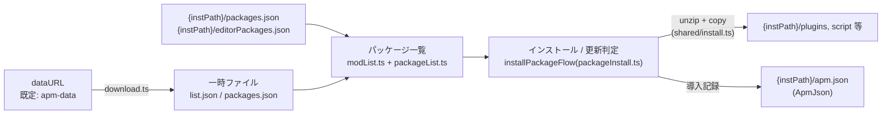

# ARCHITECTURE

apm の構造の現在地。作業ルール・確定方針は [AGENTS.md](AGENTS.md) を参照。

## プロセス構成

Electron の 3 窓 + main プロセス。窓はすべて `sandbox: true`。

| 窓     | renderer                                                                                                               | preload                         |
| ------ | ---------------------------------------------------------------------------------------------------------------------- | ------------------------------- |
| main   | `src/renderer/main/`(単一 React ルートの `App` + tRPC。タブ単位のディレクトリ。起動フローは `startup.ts` — 順序が仕様) | ログ捕捉 + tRPC bridge 公開のみ |
| about  | `src/renderer/about/`(React + tRPC)                                                                                    | ログ捕捉 + tRPC bridge 公開のみ |
| splash | `src/renderer/splash/`                                                                                                 | なし                            |

- ビジネスロジックは main プロセス(`src/main/services/`)。renderer からは tRPC(trpc-electron)で呼ぶ
- このほか `services/browser.ts` がダウンロード用のモーダルブラウザ窓を動的に生成する(forge の entryPoint ではない)
- IPC は 2 系統が併存: tRPC(主)と、レガシー `ipcMain.handle`(`src/common/ipc.ts` のチャンネル定義 + `src/lib/ipcWrapper.ts`。ダイアログ・app 情報取得など少数のチャンネルが残る)

## ディレクトリと責務

```
src/
  shared/     electron 完全非依存の純粋モジュール(main / renderer 両方から import 可)。
              ユニットテストの主対象。fs 依存の可否は AGENTS.md 落とし穴を参照
  lib/        renderer から使う electron 依存モジュール(ipcWrapper)
  common/     レガシー IPC のチャンネル名定義(ipc.ts)
  main/       main プロセス(下記)
  renderer/   窓ごとの UI(上の表を参照)。main/ 配下はタブ単位
              (aviutl / packages / nicommons / settings / others)
  types/      型定義
```

main プロセスの内訳:

```
src/main/
  index.ts        エントリ(ログ・config 初期化、app イベント、ハンドラ登録)
  windows.ts      窓生成(splash / main / about)+ 窓依存のレガシー IPC ハンドラ
  ipcHandlers.ts  窓に依存しないレガシー IPC ハンドラの登録
  api/            tRPC ルーター(index = 集約、trpc = middleware、
                  ドメイン別ルーターの procedure から services/ を呼ぶ)
  services/       ビジネスロジック(packageList / packageInstall /
                  packageUninstall / scriptInstall / packageShare / core /
                  download / modList / migration / appUpdate / settings /
                  nicommons / browser)
  Config.ts       electron-store による設定
  ApmJson.ts      {instPath}/apm.json の読み書き
```

## データフロー(パッケージ管理の中核)



- dataURL は自由入力(allowlist しない)。防御は `src/shared/resolvePath.ts` の同一オリジン + 親ディレクトリ脱出禁止(確定方針)
- `{instPath}` = ユーザーが選ぶ AviUtl インストールフォルダ。apm の状態はすべてここと electron-store(`Config.ts`)にある
- ファイルの整合性は apm-data 側の ssri ハッシュを `src/shared/integrity.ts` で検証

## このドキュメントの更新

構造が変わる PR(ディレクトリ再編、services の追加・移設、窓や IPC 系統の変更)では、この文書の該当箇所を同じ PR で更新する。
