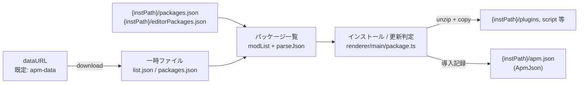

# ARCHITECTURE

apm の構造の現在地と移行先。方針の「なぜ」は [ROADMAP.md](ROADMAP.md)、作業ルールは [AGENTS.md](AGENTS.md) を参照。

## プロセス構成

Electron の 3 窓 + main プロセス。

| 窓     | renderer                            | preload                                | 状態                                         |
| ------ | ----------------------------------- | -------------------------------------- | -------------------------------------------- |
| main   | `src/renderer/main/`(レガシー DOM)  | `preload.ts`(**ビジネスロジック本体**) | `sandbox: false`。data editor 部分のみ React |
| about  | `src/renderer/about/`(React + tRPC) | tRPC クライアントのみ                  | **移行の手本**。ロジックは main プロセス側   |
| splash | `src/renderer/splash/`              | なし                                   | —                                            |

- main 窓の preload がインストール・更新チェックなどの中核ロジックを DOM 操作込みで持っている。これは歴史的経緯であり、**タブの React 化 = そのタブのロジックを main プロセス + tRPC へ移設する作業**(AGENTS.md 落とし穴参照)
- main プロセスの構成は下の「ディレクトリと責務」を参照(エントリは `src/main/index.ts`)
- IPC は 2 系統が併存する: レガシー `ipcMain.handle`(`src/common/ipc.ts` のチャンネル定義 + `src/lib/ipcWrapper.ts`)と tRPC(electron-trpc)。移行が進むとレガシー側が縮む

## ディレクトリと責務

```
src/
  shared/     electron 完全非依存の純粋モジュール(main / renderer 両方から import 可)
              compareVersion, apmPath, resolvePath, integrity, getHash
  lib/        renderer から使うモジュール(electron 依存を含む)
              Config(electron-store), ApmJson, ipcWrapper, modList, parseJson, unzip 等
  common/     IPC チャンネル定義など main / renderer の橋渡し
  main/       main プロセス(下記)
  migration/  データ形式のマイグレーション(v2 → v3)
  renderer/   窓ごとの UI(上の表を参照)
  types/      型定義
```

main プロセスの内訳:

```
src/main/
  index.ts        エントリ(ログ・config 初期化、app イベント、ハンドラ登録)
  windows.ts      窓生成(splash / main / about / browser)+ 窓依存の IPC ハンドラ
  ipcHandlers.ts  窓に依存しない IPC ハンドラの登録
  api.ts          tRPC router(タブ移行のたびに拡張)
  services/       ビジネスロジック(appUpdate, download, nicommons。タブ移行の移設先)
```

## データフロー(パッケージ管理の中核)



- dataURL は自由入力(allowlist しない)。防御は `src/shared/resolvePath.ts` の同一オリジン + 親ディレクトリ脱出禁止(確定方針)
- `{instPath}` = ユーザーが選ぶ AviUtl インストールフォルダ。apm の状態はすべてここと electron-store(`Config`)にある
- ファイルの整合性は apm-data 側の ssri ハッシュを `src/shared/integrity.ts` で検証

## 移行戦略(Strangler Fig)

1. 特性化テストで現行動作を固定(Vitest、electron 非依存の関数を優先)
2. タブ単位でロジックを main プロセス(services + tRPC)へ移設
3. React でタブ UI を再実装(About 窓のパターン)
4. 旧 preload / DOM コードを削除

タブの移行順・フェーズ全体は ROADMAP.md の「次の一手」を最新とする。

## このドキュメントの更新

構造が変わる PR(ディレクトリ再編、services 追加、タブ移行)では、この文書の該当箇所を同じ PR で更新する。
