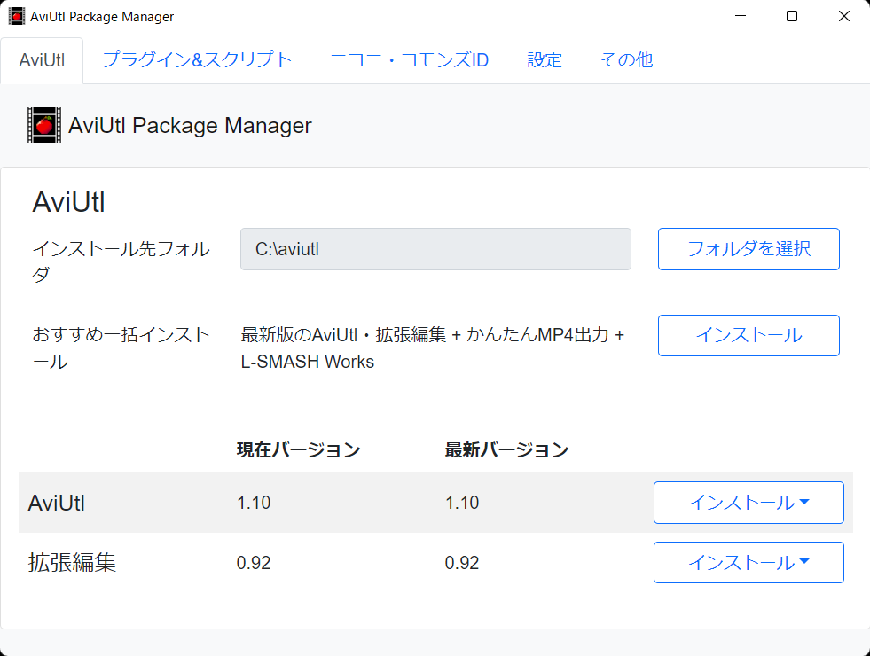
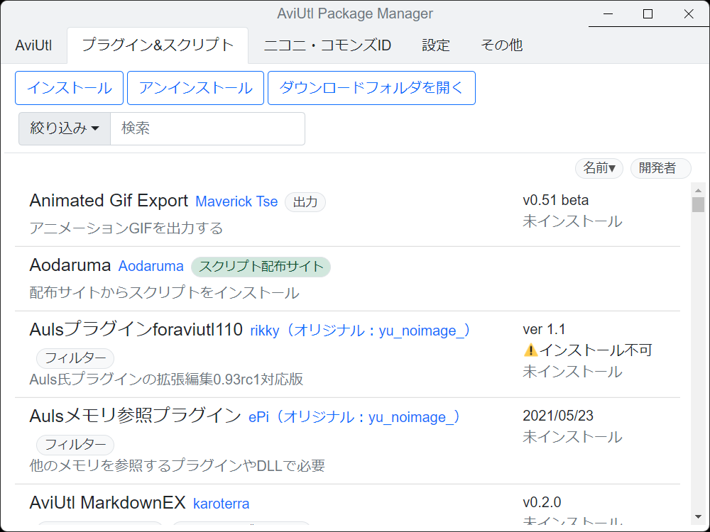
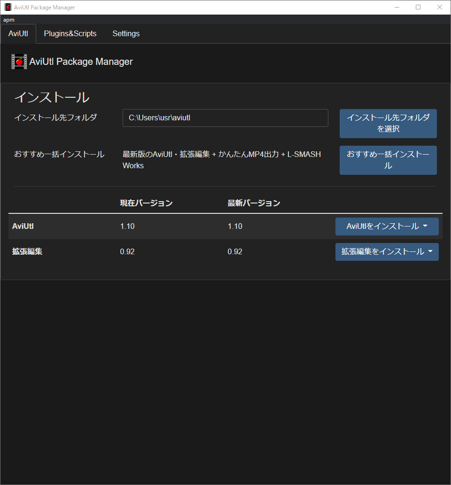

#  AviUtl Package Manager

[](https://github.com/team-apm/apm/actions/workflows/build.yml)
[](https://github.com/team-apm/apm/issues)
[](https://github.com/team-apm/apm/blob/main/LICENSE)
[](https://github.com/team-apm/apm/releases/latest)


<p>
  
  
  
  
</p>

apm is software that assists in the installation of AviUtl itself and its plugins and scripts.

- Download and update AviUtl itself and Exedit
- Download, update and delete plugins and scripts
- Support for over 50 plugins and many scripts
- Can be added to pre-installed AviUtl

Read this in [日本語](./README.md)

## Installation

Download `AviUtl.Package.Manager-{version}.Setup.exe` from Assets in [Releases](https://github.com/team-apm/apm/releases/latest). There is also a zipped version that does not require installation.

## Preparation

After launching the AviUtl Package Manager, please perform the following settings.

- If you are already using Aviutl
  1. Select the folder where Aviutl is installed from "インストール先フォルダを選択"
- For a new installation
  1. Select an empty folder where you want to install Aviutl from "インストール先フォルダを選択"
  2. select the version of Aviutl and Exedit and click the "インストール" button

## Install the packages (plugins/scripts)

1. Select the package you want to install from the "Plugins&Scripts" tab
2. The package information will be displayed
   - Open the URL in your browser and read the terms of use and precautions
   - Make sure that there are any settings required after installation
3. Click the "インストール" button
4. Download the same version of the file as shown in the "最新バージョン" on the list

### To install a script that is not in the package list

1. Open the "Plugins&Scripts" tab and select "インストール▼>リストにないスクリプトのインストール"
2. Follow the link to the author's site to download the script

### Other

- If a package cannot be installed using the above method, it can be installed using the traditional method of manually copying the files
- We have tested the Windows version only; we are not supporting the operation of the Mac or Linux versions
  - If you encounter any problems, regardless of OS, please create an Issue and report it to us
- If you have any requests for additions, updates or deletions to the list of plugins and scripts, please contact [apm-data](https://github.com/team-apm/apm-data/issues)

## Contribution

### Prerequisites

- [Git](https://git-scm.com/)
- [Node.js](https://nodejs.org/) LTS Version (Current: 14.x.x)
- [Yarn 1](https://classic.yarnpkg.com/)

### Clone

Run the following command at a location of your choice

```bash
git clone https://github.com/team-apm/apm.git
```

Or, after forking the repository, run the following command

```bash
git clone https://github.com/${username}/apm.git
```

### Build

After navigating to your cloned directory, install the package

```bash
cd apm
yarn
```

### Run

Start the application.

```bash
yarn start
```

See [CONTRIBUTING.md](./CONTRIBUTING.md) for details.

Also, I'm Japanese, so any pull requests related to English or i18n are most welcome!

## Languages & Framework

- Electron (Node.js)
  - HTML
  - CSS
  - JavaScript

## License

Source Code: [MIT license](./LICENSE)

## Developer

ato lash

- [GitHub](https://github.com/hal-shu-sato)
- [Homepage](http://halshusato.starfree.jp/)
- [Twitter](https://twitter.com/hal_shu_sato)

## Contributor

[@mitosagi](https://github.com/mitosagi)

## Thanks

Many English documents have been translated with www.DeepL.com/Translator (free version)
