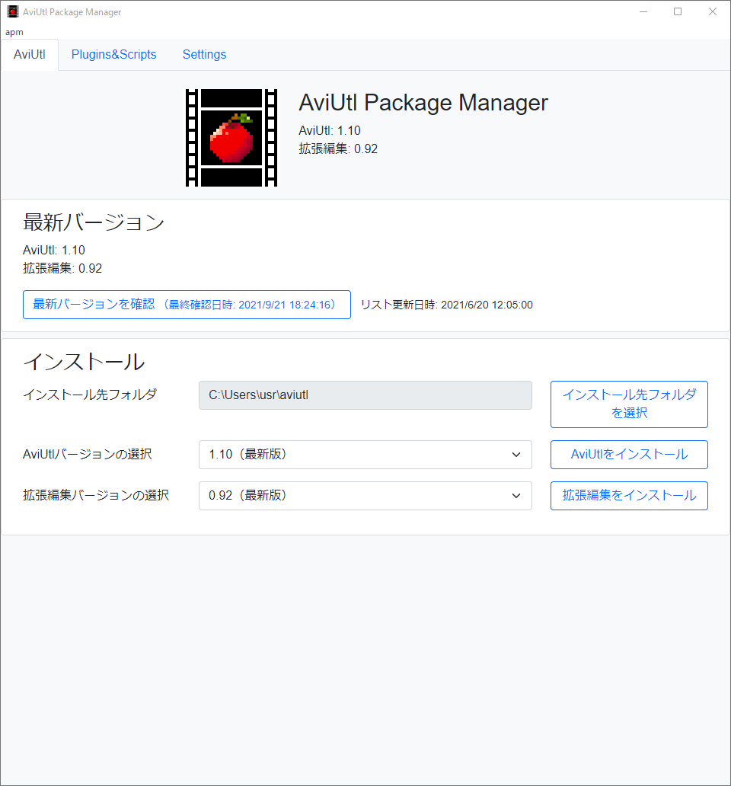
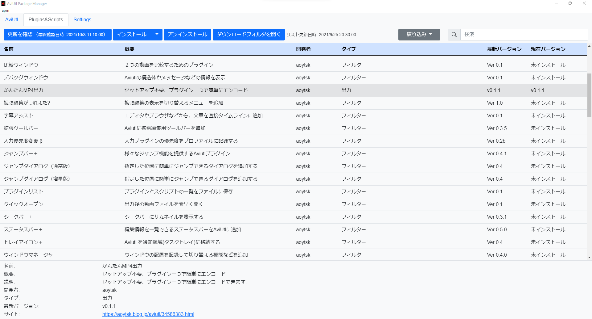

#  AviUtl Package Manager

[](https://github.com/hal-shu-sato/apm/actions/workflows/build.yml)
[](https://github.com/hal-shu-sato/apm/issues)
[](https://github.com/hal-shu-sato/apm/blob/main/LICENSE)
[](https://github.com/hal-shu-sato/apm/releases/latest)


<p>
  
  
</p>

AviUtl本体やプラグイン・スクリプトの導入を補助するソフトウェアです。

- AviUtl本体と拡張編集のダウンロード・更新
- プラグインとスクリプトのダウンロード・更新・削除
- 50を超えるプラグインと多数のスクリプトに対応
- インストール済みのAviUtlへ追加可能

_Read this in [English](./README.en.md)_.

## ダウンロード

[Releases](https://github.com/hal-shu-sato/apm/releases/latest)のAssetsから`AviUtl.Package.Manager-{version}.Setup.exe`をダウンロードします。インストール不要のzip版もあります。

## 準備

AviUtl Package Managerを起動した後は次の設定を行ってください。

- すでにAviutlをお使いの場合
  1. 「インストール先フォルダを選択」からAviutlがインストールされているフォルダを選択します
- 新規インストールの場合
  1. 「インストール先フォルダを選択」からAviutlをインストールする空のフォルダを選択します
  2. Aviutlと拡張編集のそれぞれのバージョンを選択してインストールします

## パッケージ（プラグイン・スクリプト）の導入

1. 「Plugins&Scripts」タブからインストールしたいパッケージを選びます
2. パッケージの情報が表示されます
   - URLをブラウザで開き利用規約や注意事項を読んでください
   - インストール後に必要な設定がないか確認してください
3. 「インストール」ボタンを押します
4. 表示された作者サイトから、リストに表示された「最新バージョン」と同じバージョンのファイルをダウンロードします

### パッケージ一覧にないスクリプトを導入する場合

1. 「Plugins&Scripts」タブを開き、「インストール▼>リストにないスクリプトのインストール」を選択します
2. リンクをたどり作者サイトに移動して、スクリプトをダウンロードします

### その他

- 上記の方法で導入できないパッケージも、従来の手動でファイルをコピーする方法で導入できます
- プラグイン・スクリプト一覧への追加・更新・削除等の要望は[apm-data](https://github.com/hal-shu-sato/apm-data/issues)までお知らせください。

## コントリビューション

### 前提条件

- [Git](https://git-scm.com/)
- [Node.js](https://nodejs.org/) LTSバージョン（現在14.x.x）
- [Yarn 1](https://classic.yarnpkg.com/)

### クローン

任意の場所で以下のコマンドを実行します。

```bash
git clone https://github.com/hal-shu-sato/apm.git
```

あるいは、リポジトリをフォークした後、以下のコマンドを実行します。

```bash
git clone https://github.com/${ユーザー名}/apm.git
```

### 環境構築

クローンしたディレクトリに移動した後、パッケージをインストールします。

```bash
cd apm
yarn
```

### 実行

アプリを起動します。

```bash
yarn start
```

詳しくは、[CONTRIBUTING.ja.md](./CONTRIBUTING.ja.md)を参照してください。

英語やi18nに関するプルリクエストは大歓迎です！

### 使用言語・フレームワーク

- Electron (Node.js)
  - HTML
  - CSS
  - JavaScript

## ライセンス

ソースコード: [MIT license](./LICENSE)

## 開発者

**ato lash**

- [GitHub](https://github.com/hal-shu-sato)
- [Homepage](http://halshusato.starfree.jp/)
- [Twitter](https://twitter.com/hal_shu_sato)
