#  AviUtl Package Manager

  
  

## 目次

- [apmのチュートリアル](#apmのチュートリアル)
- [プラグイン・スクリプトとは](#プラグイン・スクリプトとは)
- [プラグイン・スクリプト一覧への追加](#プラグイン・スクリプト一覧への追加)

## apmのチュートリアル

### ダウンロード

[Releases](https://github.com/hal-shu-sato/apm/releases/latest)のAssetsから`AviUtl.Package.Manager-{version}.Setup.exe`をダウンロードします。インストール不要のzip版もあります。

### 準備

AviUtl Package Managerを起動した後は次の設定を行ってください。

- すでにAviutlをお使いの場合
  1. 「インストール先フォルダを選択」からAviutlがインストールされているフォルダを選択します
- 新規インストールの場合
  1. 「インストール先フォルダを選択」からAviutlをインストールする空のフォルダを選択します
  2. Aviutlと拡張編集のそれぞれのバージョンを選択してインストールします

### パッケージ（プラグイン・スクリプト）の導入

1. 「Plugins&Scripts」タブからインストールしたいパッケージを選びます
2. パッケージの情報が表示されます
   - URLをブラウザで開き利用規約や注意事項を読んでください
   - インストール後に必要な設定がないか確認してください
3. 「インストール」ボタンを押します
4. 表示された作者サイトから、リストに表示された「最新バージョン」と同じバージョンのファイルをダウンロードします

#### パッケージ一覧にないスクリプトを導入する場合

1. 「Plugins&Scripts」タブを開き、「インストール▼>リストにないスクリプトのインストール」を選択します
2. リンクをたどり作者サイトに移動して、スクリプトをダウンロードします

#### その他のパッケージの導入

1. 上記の方法で導入できないパッケージも、従来の手動でファイルをコピーする方法で導入できます

- 一覧へ追加したいパッケージがあれば[apm-data](https://github.com/hal-shu-sato/apm-data/issues)までお知らせください。

## プラグイン・スクリプトとは

プラグインやスクリプトはAviUtlの機能を拡張するためのファイルです。AviUtlへ追加することで、使い勝手を向上させたり、さまざまな動画表現を利用可能にします。AviUtlには用途の異なる10種類のプラグイン・スクリプトが存在しており、種類によって拡張される機能の種類や利用できる場面が異なります。

### プラグイン（5種類）

- 入力プラグイン：読み込める素材の種類（.mp4, .wmv等）を増やす
- 出力プラグイン：動画出力（エンコード）の方法を増やす
  - AviUtlの「ファイル＞プラグイン出力」から利用できます
- フィルタプラグイン：素材に効果を掛ける・AviUtlを使いやすくする
  - 名前から想像される素材に効果を掛ける機能はスクリプトに譲っており、ほとんどのフィルタプラグインはAviUtlの使いやすさを向上させるためのものです
  - フィルタプラグインには適用される順番があり、これが重要になることがあります
- 図にないその他の2種類
  - 色変換プラグイン：色空間の変換を行います
  - 言語拡張リソース：AviUtlの翻訳を行います

### スクリプト（5種類）

- カスタムオブジェクト：動画・画像などの素材（オブジェクト）に似たものを追加します
  - 例：タイマー、雨、雲、レンズフレア
- シーンチェンジ：動画と動画を切り替えるときの効果を追加します
  - 例：クロスフェード、ワイプ、スライド
- トラックバー変化：トラックバーの変化にバリエーションを追加します
  - 例：直線移動、加速、減速
- アニメーション効果：素材にさまざまな効果を掛けることができます
  - 例：色調補正、ぼかし、クリッピング
- カメラ効果：カメラ制御による3D的な表現を行うときに、カメラの動きを補助してくれます
  - 例：平行移動、回転
  - 図には記載していません

参考にしたサイト

- [プラグイン - AviUtl](https://scrapbox.io/aviutl/%E3%83%97%E3%83%A9%E3%82%B0%E3%82%A4%E3%83%B3)
- [スクリプトファイル フォーマット - aviutl-script](https://scrapbox.io/aviutl-script/%E3%82%B9%E3%82%AF%E3%83%AA%E3%83%97%E3%83%88%E3%83%95%E3%82%A1%E3%82%A4%E3%83%AB_%E3%83%95%E3%82%A9%E3%83%BC%E3%83%9E%E3%83%83%E3%83%88)

## プラグイン・スクリプト一覧への追加

プラグイン・スクリプト一覧への追加・更新・削除等の要望は[apm-data/issues](https://github.com/hal-shu-sato/apm-data/issues)にて受け付けています。

## その他

このページ内の図は「draw.io」や「vscode draw.io拡張機能」を使って編集できます。
